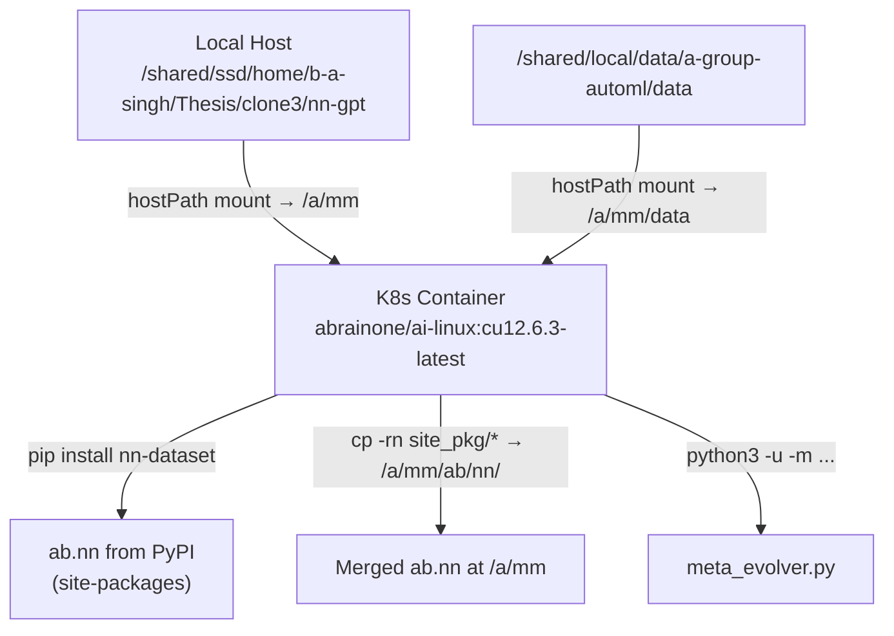

# nn-gpt Clone3 — Complete Setup Guide

## 1. Architecture Overview



- **No `.venv`** — the project runs inside a Kubernetes container, not a local virtual environment
- The container image `abrainone/ai-linux:cu12.6.3-latest` comes pre-installed with Python 3.12, PyTorch, CUDA 12.6.3
- Your local codebase is **bind-mounted** into the container at `/a/mm`

---

## 2. Kubernetes Job Configuration

**File:** [meta_evol_tune_nngpt.json](file:///shared/ssd/home/b-a-singh/Thesis/clone3/nn-gpt/ab/gpt/brute/ga/meta_evolution/meta_evol_tune_nngpt.json)

### 2.1 Container Startup Sequence (line 22)

```bash
cd /a/mm \
  && pip uninstall -y flash-attn \                          # 1. Remove flash-attn (causes PermissionError)
  && pip install git+https://github.com/ABrain-One/nn-dataset \
       --upgrade --extra-index-url https://download.pytorch.org/whl/cu126 \  # 2. Install nn-dataset from GitHub
  && export PYTHONPATH=/a/mm \                              # 3. Set Python path to mounted codebase
  && site_pkg=$(python3 -c 'import site; print(site.getusersitepackages())') \  # 4. Find site-packages
  && mkdir -p /a/mm/ab/nn \
  && cp -rn $site_pkg/ab/nn/* /a/mm/ab/nn/ || true \        # 5. Copy NEW files from pip into local (no-clobber)
  && python3 -u -m ab.gpt.brute.ga.meta_evolution.meta_evolver  # 6. Run the meta evolver
```

### 2.2 Volume Mounts

| Mount | Volume | Host Path | Purpose |
|-------|--------|-----------|---------|
| `/a/mm` | `v0` | `clone3/nn-gpt` | Main codebase |
| `/a/mm/data` | `v1` | `a-group-automl/data` | Shared datasets |
| `/dev/shm` | `shm` | *emptyDir (Memory)* | Shared memory (16Gi) |

> [!CAUTION]
> The `v0` hostPath **must match your clone directory**. For `clone3`:
> ```json
> "path": "/shared/ssd/home/b-a-singh/Thesis/clone3/nn-gpt"
> ```
> The original repo uses `/shared/ssd/home/b-a-singh/Thesis/nn-gpt` — mixing these up causes the container to run stale code.

### 2.3 Environment Variables

| Variable | Default | Purpose |
|----------|---------|---------|
| `POPULATION_SIZE` | `10` | GA population size |
| `GENERATIONS` | `5` | GA generations per benchmark |
| `MUTATION_RATE` | `0.6` | Mutation probability |
| `META_ATTEMPTS` | `10` | Number of meta-evolution iterations |

### 2.4 Resources

- **GPU:** 1× NVIDIA GPU
- **CPU:** 10 (request) / 16 (limit)
- **Memory:** 32Gi (request) / 64Gi (limit)

---

## 3. Key Dependencies

**File:** [requirements.txt](file:///shared/ssd/home/b-a-singh/Thesis/clone3/nn-gpt/requirements.txt)

| Package | Version | Why |
|---------|---------|-----|
| `torch` | `==2.9.1` | Core ML framework |
| `nn-dataset` | `>=2.2.7` | ABrain neural network dataset (provides `ab.nn`) |
| `peft` | `>=0.14.0` | LoRA adapter support |
| `bitsandbytes` | `>=0.45.0` | 4-bit quantization |
| `unsloth` | `==2026.3.4` | Fast fine-tuning |
| `triton` | `>=3.4.0` | GPU kernel compilation |

---

## 4. Common Errors & Fixes

### 4.1 `ModuleNotFoundError: No module named 'ab.nn.util.db.Query'`

**Root cause:** `pip install nn-dataset --upgrade` installs a version of `ab.nn` that may overwrite or shadow local files. If the pip version has `api.py` importing `Query` but the local `ab/nn/util/db/` doesn't have it (or vice versa), imports crash.

**Fix options:**
1. Ensure the `v0` hostPath points to the **correct clone** (see §2.2 above)
2. The `cp -rn` in the startup copies *new* pip files into local without overwriting — this usually resolves version gaps
3. Pin `nn-dataset` to a known-compatible version if the latest breaks things

### 4.2 `HFValidationError: Repo id must be in the form 'repo_name'...`

**Root cause:** `PeftModel.from_pretrained()` treats a local path as a HuggingFace repo ID when the `huggingface_hub` library is newer.

**Fix applied in [llm_loader.py](file:///shared/ssd/home/b-a-singh/Thesis/clone3/nn-gpt/ab/gpt/brute/ga/meta_evolution/llm_loader.py):**
```python
# Check if adapter weight files actually exist
adapter_weights_exist = False
if adapter_path and os.path.exists(adapter_path):
    weight_files = ["adapter_model.safetensors", "adapter_model.bin"]
    adapter_weights_exist = any(os.path.isfile(os.path.join(adapter_path, wf)) for wf in weight_files)

if adapter_weights_exist:
    self.model = PeftModel.from_pretrained(self.model, adapter_path,
                                           is_trainable=True, local_files_only=True)
else:
    # Initialize fresh LoRA adapters
    ...
```

### 4.3 `PermissionError: flash_attn dist-info`

**Root cause:** The container image has `flash-attn` installed system-wide as root. Your user (UID 1017) can't uninstall it cleanly.

**Current workaround:** `pip uninstall -y flash-attn` in the startup command. The `PermissionError` during cleanup is non-fatal — it still removes the package from Python's import path.

---

## 5. Deployment Commands

### Deploy / Redeploy
```bash
kubectl delete job nngpt-fractal-meta-evo-clone3 --ignore-not-found \
  && kubectl apply -f /shared/ssd/home/b-a-singh/Thesis/clone3/nn-gpt/ab/gpt/brute/ga/meta_evolution/meta_evol_tune_nngpt.json
```

### Monitor Logs (live)
```bash
kubectl logs -f -l job-name=nngpt-fractal-meta-evo-clone3
```

### Check Job Status
```bash
kubectl get jobs nngpt-fractal-meta-evo-clone3
kubectl describe job nngpt-fractal-meta-evo-clone3
```

---

## 6. Project File Structure (`meta_evolution/`)

```
meta_evolution/
├── meta_evol_tune_nngpt.json     # K8s Job config (THIS clone)
├── meta_evolver.py               # Main meta-evolution loop
├── llm_loader.py                 # LLM + LoRA loading/training
├── rl_rewards.py                 # Reward calculation
├── genetic_algorithm.py          # GA being evolved by meta-evolver
├── run_fractal_evolution.py      # Runner/benchmark script
├── FractalNet_evolvable.py       # Evolvable FractalNet architecture
├── best_fractal_model.py         # Best discovered model
├── train_existing_archs.py       # Train pre-existing architectures
├── train_existing_archs.json     # K8s Job for training existing archs
├── fine_tuned_adapter/           # LoRA adapter checkpoint (when saved)
├── ga_history_backup/            # GA file backups per iteration
├── ga_fractal_arch/              # Evolved architecture outputs
├── stats/                        # Training statistics
└── secondary_stats/              # Secondary statistics
```

---

## 7. New Clone Quick-Start Checklist

- [ ] Clone the repo: `git clone <repo-url> /shared/ssd/home/b-a-singh/Thesis/<cloneN>/nn-gpt`
- [ ] Copy the K8s JSON: `cp meta_evol_tune_nngpt.json` and update:
  - [ ] `metadata.name` → unique job name (e.g., `nngpt-fractal-meta-evo-clone<N>`)
  - [ ] `v0` hostPath → `/shared/ssd/home/b-a-singh/Thesis/<cloneN>/nn-gpt`
- [ ] Verify `llm_loader.py` has the adapter weight-file check (§4.2)
- [ ] Deploy: `kubectl apply -f meta_evol_tune_nngpt.json`
- [ ] Monitor: `kubectl logs -f -l job-name=<job-name>`
